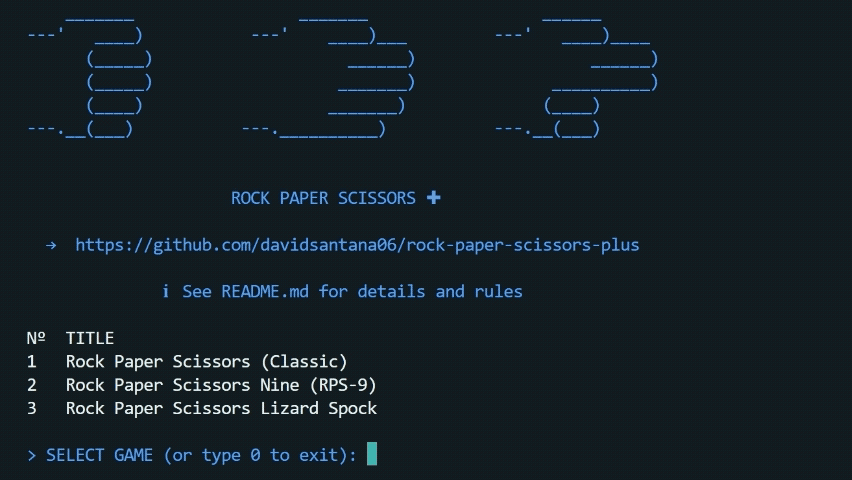

**✂️ Rock Paper Scissors Plus ➕** is a Java console application featuring three versions of the classic game: the traditional Classic with 3 gestures, the extended RPS-9 with 9, and the popular Rock Paper Scissors Lizard Spock with 5.

It uses a modular architecture based on the **Service Provider Interface (SPI)**, allowing easy addition of new variants while keeping a consistent terminal interface and gameplay.


## 🕹️ How to Play

1. Select a game variant.
2. Choose your gesture from the list displayed.
3. The computer will pick its gesture randomly.
4. The result is displayed, showing the winner.

Available games include:

### ✂️ Rock Paper Scissors (Classic)

| Gesture      | Wins against | Loses against |
| ------------ | ------------ | ------------- |
| **Rock**     | Scissors     | Paper         |
| **Paper**    | Rock         | Scissors      |
| **Scissors** | Paper        | Rock          |

### 🔫 Rock Paper Scissors Nine (RPS-9)

| Gesture      | Wins against                   | Loses against                   |
| ------------ | ------------------------------ | ------------------------------- |
| **Rock**     | Fire, Scissors, Human, Sponge  | Paper, Air, Water, Gun          |
| **Paper**    | Rock, Air, Water, Gun          | Scissors, Fire, Human, Sponge   |
| **Scissors** | Paper, Human, Sponge, Air      | Rock, Fire, Water, Gun          |
| **Fire**     | Scissors, Paper, Human, Sponge | Rock, Air, Water, Gun           |
| **Human**    | Sponge, Paper, Air, Water      | Rock, Scissors, Fire, Gun       |
| **Sponge**   | Paper, Air, Water, Gun         | Rock, Scissors, Fire, Human     |
| **Air**      | Fire, Rock, Water, Gun         | Paper, Scissors, Human, Sponge  |
| **Water**    | Rock, Fire, Scissors, Gun      | Paper, Human, Sponge, Air       |
| **Gun**      | Rock, Scissors, Human          | Paper, Sponge, Air, Water, Fire |

### 🖖 Rock Paper Scissors Lizard Spock

| Gesture      | Wins against     | Loses against    |
| ------------ | ---------------- | ---------------- |
| **Rock**     | Scissors, Lizard | Paper, Spock     |
| **Paper**    | Rock, Spock      | Scissors, Lizard |
| **Scissors** | Paper, Lizard    | Rock, Spock      |
| **Lizard**   | Paper, Spock     | Rock, Scissors   |
| **Spock**    | Rock, Scissors   | Paper, Lizard    |

## 🛠️ Installation and Execution

Built with **Docker** and **Docker Compose**. From the root directory, build and run:

```bash
docker compose build
docker compose run --rm -it rock-paper-scissors-plus
```

## 🤝 Donation

If you like the project and want to support it financially, you can contribute via **PayPal** or **Pix** — _aos meus chegados do Brasil_ — by clicking one of the options below:

[](https://www.paypal.com/donate/?hosted_button_id=2P9HPGUP7Z43S)
&nbsp;
[](https://tipa.ai/davidsantana06)

## 📚 References

- SENIOR JAVA TECHNICAL INTERVIEW R$10K CLT BR COMPANY. YouTube, available at: [https://youtube.com/watch?v=r_SRTbbtlD4](https://youtube.com/watch?v=r_SRTbbtlD4).
- RPS-9. UMOP, available at: [https://umop.com/rps9.htm](https://umop.com/rps9.htm).
- Rock, Paper, Scissors, Lizard, Spock. The Big Bang Theory Wiki, available at: [https://bigbangtheory.fandom.com/wiki/Rock,\_Paper,\_Scissors,\_Lizard,\_Spock](https://bigbangtheory.fandom.com/wiki/Rock,_Paper,_Scissors,_Lizard,_Spock).

## ⚖️ License

Licensed under the **MIT License**, allowing free use and modification with proper credit.
